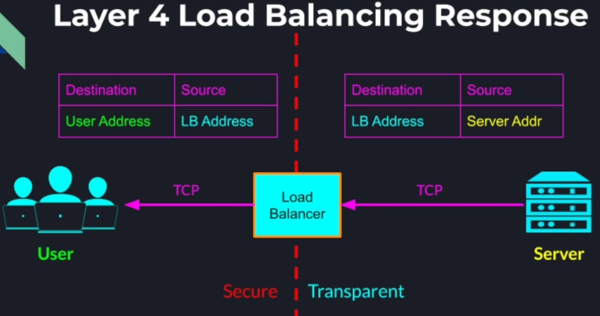
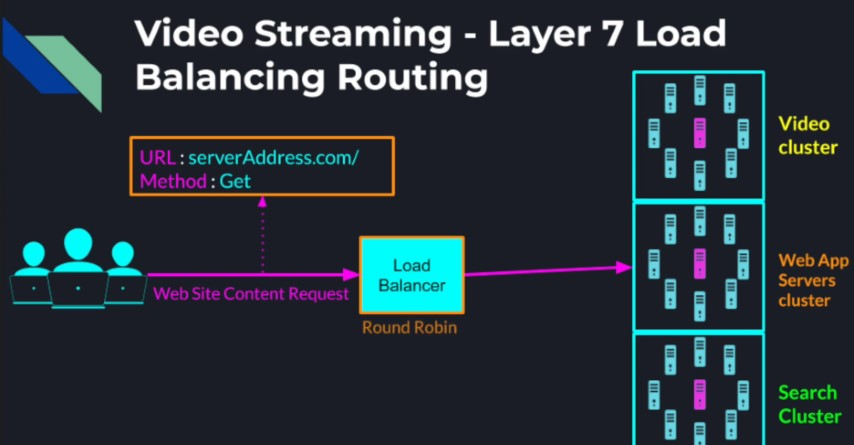
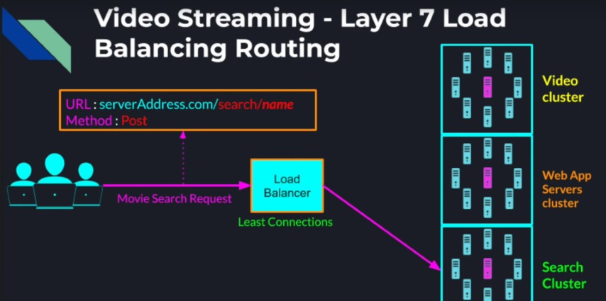
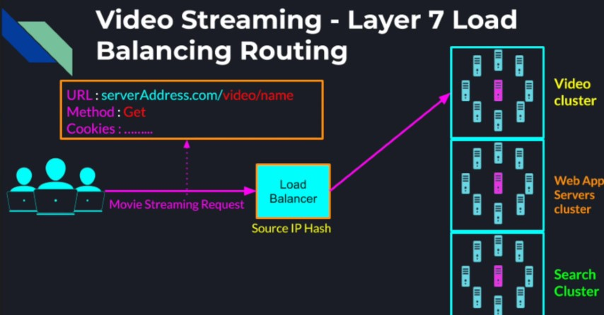

## Load Balancing Layers

Since all the traffic to our system flows through the load balancers, there are typically two networking layers on which
the load balancer can inspect the traffic and route it to the application servers.

```shell
OSI Model         TCP/IP Model
-------------------------------     
Application       Application
Presentation
Session
-------------------------------
Transport         Transport
-------------------------------
Network           Internet
-------------------------------
Data Link         Data Link
Physical
-------------------------------
```

* Transport Layer Load Balancing
    * Layer 4 in the OSI Model
    * Simple load balancing
    * Lowest load balancing overhead
* Application Layer Load Balancing
    * Layer 7 in the OSI Model
    * For better control over incoming traffic routing to our system

### Layer 4 (Transport) Load Balancing

The Load Balancer performs simple TCP packets forwarding between the client and the backend servers. Does not inspect
the content of the TCP stream beyond the first few packets - Low overhead. In this mode the only part of the TCP stream
that the load balancer is concerned with is the source and the destination IP address and port present in the TCP
header. For every request from the user to the load balancer, the load balancer needs to replace the source address with
its own address and replace the destination address with the backend servers address the load balancer decided to send
the request to. For every TCP packet the server sends back, the load balancer needs to replace source address with its
own again and replace the destination IP and port back to the users IP and port. This way the user never knows any
details about the actual servers address that handled its request. <br />


### Layer 7 (Application) Load Balancing

Can make smarter routing decisions based on the HTTP header. Load balancer inspects TCP packets and HTTP header. <br />
Can route requests to different clusters of servers based on:

* Request URL
* Type of requested data
* HTTP method
* Browser cookies

**Example 1** <br />
_**Video Streaming web based service - Layer 7 Load Balancing Routing**_ <br />
The general request to load the websites text and images can be routed by the load balancer to the general WebApp server
cluster. When routing the request to this backend cluster, we may choose a strategy like round-robin for balancing the
load among the individual servers. <br />


Later when a user wants to search for a particular movie, the load balancer would route the request to our search
compute cluster where we can maintain a different load balancing strategy such as the least connections'
strategy. <br />


Finally, when the user sends a request to start streaming the actual movie, the load balancer may route the request to
our dedicated video cluster. For this cluster we may use the combination of the users cookie and the source IP hash
strategy to maintain a continuous connection between the user and a particular server throughout the entire streaming
session. <br />


**Example 2** <br />
We are building a restaurant business that takes food orders from users and directs those orders to our specialized
kitchens represented by 2 separate services

* Bakery Kitchen Service
* Salads Kitchen Service

To distinguish between different orders from our UI we place the type of the order in the relative URI of the
request <br />
For example an order for a **salad** would look like this: <br />
_http://www.awesome-food.com/salads?caesar-salad=1_ <br />
An order for 2 **apple pies** would look like this: <br />
_http://www.awesome-food.com/bakery?apple-pie=2_ <br />

Since we need to route requests based on their relative URI, which is part of the HTTP Request header, we need to
configure our load balancer for HTTP Mode.

**Example 3** <br />
We are building a Storage Service, where documents are stored. Each server in our backend contains a copy of all the
documents available for download. Many users send us requests concurrently to download documents from our service, so we
need to be able to spread the load among a large number of servers. A strict requirement is we need to keep our overhead
and latency at the absolute minimum, in order to serve as many users as we can. <br />
To keep the latency at the very minimum, we can default to the TCP layer for the communication, and for that a TCP mode
load balancer will be the best choice
