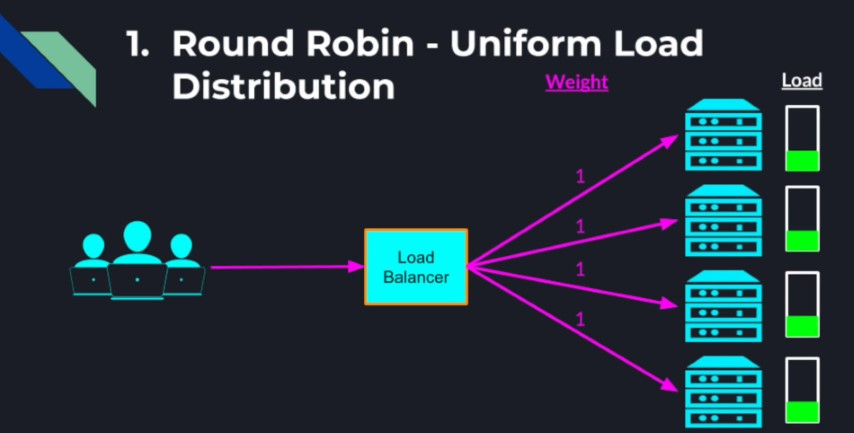
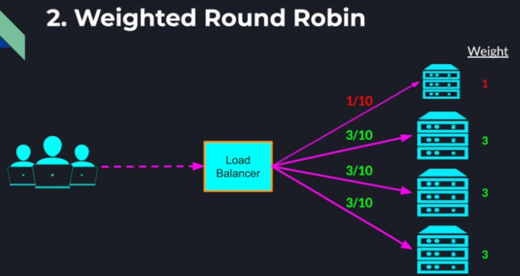
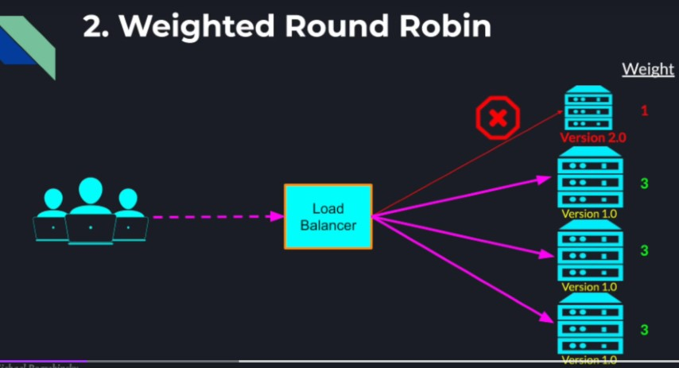
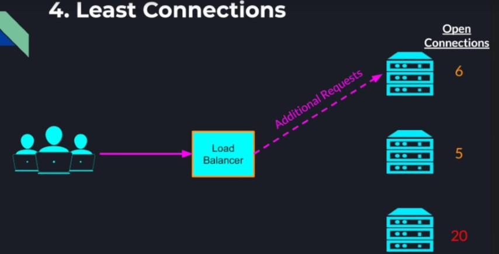
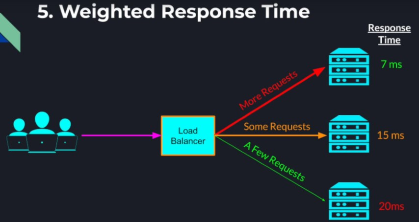
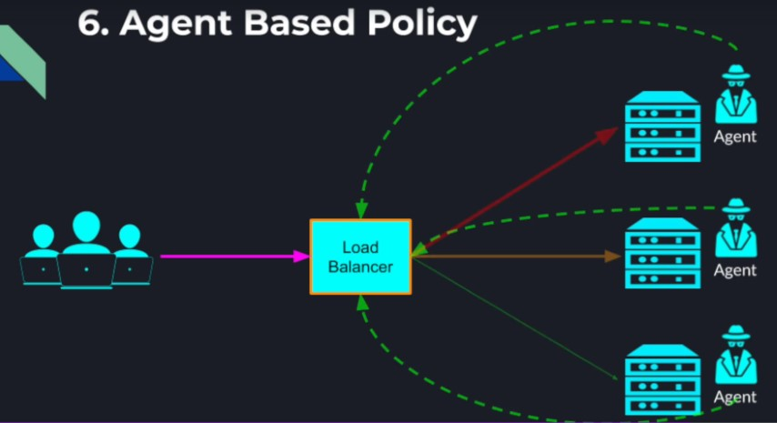

## Load balancing motivation

From the previous implementation of Distributed Search, our user facing server is in fact a single point of failure. if
the server goes down of a few seconds the users will lose access to our distributed system altogether. And even if our
server stays functional, once our system scales to a large number of users the single server will not be able to handle
an ever-increasing load.  
Also, as the number of users grow the search coordinator starts getting more and more request it needs to handle. And as
the number of documents grow, and we add more worker nodes into the search cluster the search coordinator needs to send
more outbound requests which requires opening a lot more connections and potentially exceeding the operating systems
limit. The search coordinator will also have to receive a lot more data back from the workers which will put a lot of
pressure on the search coordinator during the aggregation step.  
Although the search coordinator is not a single point of failure, as any worker can automatically take its place. It is
definitely a bottleneck in our system and can cause the entire system to slow down or stop altogether.

### Once solution is to add more instances of the bottleneck service:  

**For Example**:-  

1. We can modify the Leader Election algorithm to elect not one but multiple coordinators.  
2. Or we can separate the coordinators and workers nodes entirely and have a pool of identical coordinators that can
   potentially split the workload. Then all those search coordinators can register themselves into the coordinators
   service registry and once the user facing server pulls all the coordinators addresses it can evenly split the load
   among the coordinators which would reduce the performance pressure on each coordinator instance.

_Problem with Load Balancing with Service Registry -_  

1. Drawback 1, It couples every two systems with a Service Registry, which is an internal component to our system. If we
   are providing service externally through a public API this type of coupling would not work. We want to hide all the
   implementation details by providing a single address which would create an illusion of talking to a single machine.
2. Drawback 2, It forces the client to implement the load balancing logic in each application that needs to talk to
   another cluster. This is not part of the core functionality of the client application. Also, with the multiple
   user-facing servers with unique addresses, we definitely cannot expect our end users to maintain a list of addresses
   of our user facing servers (for the GUI) and load balance between them when the users are not even aware of each
   other.

### Load Balancers in Distributed System

1. Distributes network traffic across a cluster of application servers.
2. Prevents any single application server from being a performance bottleneck.
3. Monitors application servers' health, load balancers make our system more reliable.

**For Example**:-  
Instead of the users sending request to our user facing server directly, we can place a load balancer in between which
directs the traffic between the user and the user facing server. Then we can increase the number of servers completely
transparently to the user and the load balancer will fairly spread the load among those servers. We can repeat the same
pattern anywhere in our distributed system. Using periodic health checks to our servers the load balancer can spot a
faulty server and stop directing traffic to it by taking it out of its rotation. And when the server reports that its
healthy again it can be brought back to the rotation and start getting new traffic.

_Could Auto-Scaling with load balancers-_  
In a cloud environment machines can be added on demand. A load balancer can provide auto-scaling/down-scaling
capabilities.

**For Example**:-  
A load balancer detected the load on our server reached a high threshold at which our servers may not be able to keep up
for much longer. Once that threshold is reached, the load balancer can automatically add more servers into our cluster
to meet the increase in demand from our clients. Later when the load goes down below a certain threshold, the load
balancer can shut down some servers to save on running costs.

### Types of Load Balancers

1. Hardware Load Balancers - dedicated hardware devices designed and optimized for the load balancing
    * High performance
    * Can balance the load to larger number of servers
    * More reliable
2. Software Load Balancers - load balancing programs which runs on general purpose computers that performs the load
   balancing logic.
    * Easy to configure, update, upgrade or troubleshoot
    * Cheaper and more cost-effective
    * Open source solutions are available (HAProxy, Nginx)

### Load balancing strategies

1. **Round Robin**  
   Each server gets one request in each turn and once we send at least one request to each server, we start over.
   Assuming all requests cause the same amount of load in any given server and that all the servers are identical, this
   guarantees a uniform load distribution through our entire cluster.  
     
2. **Weighted Round Robin**  
   If some of our servers are more capable of taking higher load or if we intentionally want to direct more traffic to
   some servers and less to others, we can use this strategy. We assign a higher weight to service we want to send more
   requests relative to others.  
   In the below example, the top server will receive only one out of every 10 incoming requests whereas the rest of the
   servers are weighted 3 times higher, which would spread the remaining 90% of the traffic equally among those
   servers.  
     
   Weighted round-robin can help not only if we have hardware asymmetry, but also if we want to release newer version of
   our application software more gradually by upgrading only one of the servers to the new version and direct only a
   small portion of the traffic to that staging host. Later when we are confident to roll this new version to the entire
   cluster, we can upgrade the remaining servers but if something went wrong in this new version then the impact is
   going to be much smaller.  
     
3. **Source IP Hash**
    * Sometimes it's desired that the user continues communication with the same server
    * _Examples:_
        * Open Session - Maintaining online shopping cart state between connection loses or browser refresh
        * Local Server Caching - Improving performance by
            * Preloading data
            * Caching data locally
    * Requests from the same user should go to the same server throughout the entire session  
      One way to achieve this session stickiness is by hashing the IP address of the user and used this hashed value to
      determine what server to direct the request. Since the hash function is deterministic, requests from the same user
      will always be directed to the same server.

_Drawbacks of Statistical Load Balancing_  
We assumed that spreading the requests evenly would also spread the load evenly. However, that is not always the case.
Not all users are using the system the same way and not all the requests require the same amount of resources. Getting
the load balancing strategy wrong can have a cascading chain of failures in our system that can be very hard to recover
from.  
**Cascading Failure (Round Robin)**  
If two of our servers are getting mostly simple GET requests for static pages, but the third server is getting a lot of
POST requests that require heavy computations and talking to external services, it would quickly get overwhelmed and
stop responding to health checks. This in turn would make the load balancer believe that, that server has gone offline
so the load balancer will stop sending the server any more traffic. Now we end up in a situation where all the request
that the load balancer is receiving would have to go to the remaining two servers. These remaining two servers will also
get quickly overwhelmed which would cause our entire cluster to become unavailable.

_Different Load on Servers problem_  
All the strategies we mentioned till now didn't take the actual load on the servers into account. If we have a range of
resources requirements between different requests, the solution is to take a more active approach to monitoring servers'
load.

4. **Least Connections**  
   Servers which already have many open connections are assumed to be more busy handling requests and therefore will
   receive less additional requests than server that have fewer open connections.  
   
5. **Weighted Response Time**  
   Takes advantage of the periodic health check requests the load balancer sends to the servers and measures the time
   each server takes to respond. If the server is busy handling real requests, it would take it longer to respond to
   those health checks which would give the server a lower weight in the load balancing algorithm.
   
6. **Agent Based Policy**  
   More active approach by installing a special agent program on each of the application servers. This agent background
   process can measure the CPU utilization, Inbound or outbound Network Traffic(bytes), Disk Operations (Reads/Writes),
   Memory Utilization... Others custom metrics. These agents can report those metrics in real time to the load balancer
   which will help it make the most informed decisions regarding the best way direct the traffic to our application
   nodes.  
   

**Example**

1. Our Layer 7 (HTTP) Load Balancer is directing user traffic to a backend service, consisting of 4 identical servers.
   The Load Balancer is configured to operate in the Weighted Round Robin Strategy. The weights are:
    * Server 1: 1
    * Server 2: 1
    * Server 3: 3
    * Server 4: 5  
      For every 30 incoming requests to the load balancer. How many requests would be forwarded to server 3?  
      For every 10 requests, Server 3 receives 3 requests. Therefore, for 30 incoming requests to the load
      balancer,server 3 will receiver 9 requests.