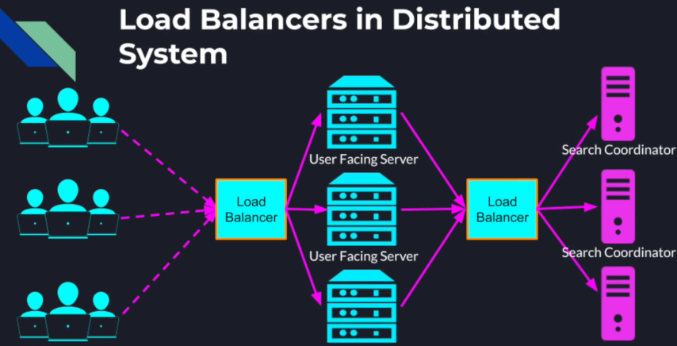
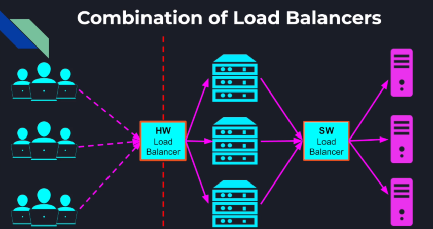

## Load balancing motivation

From the previous implementation of Distributed Search, our user facing server is in fact a single point of failure. if
the server goes down of a few seconds the users will lose access to our distributed system altogether. And even if our
server stays functional, once our system scales to a large number of users the single server will not be able to handle
an ever-increasing load.  
Also, as the number of users grow the search coordinator starts getting more and more request it needs to handle. And as
the number of documents grow, and we add more worker nodes into the search cluster the search coordinator needs to send
more outbound requests which requires opening a lot more connections and potentially exceeding the operating systems
limit. The search coordinator will also have to receive a lot more data back from the workers which will put a lot of
pressure on the search coordinator during the aggregation step.  
Although the search coordinator is not a single point of failure, as any worker can automatically take its place. It is
definitely a bottleneck in our system and can cause the entire system to slow down or stop altogether.

### Once solution is to add more instances of the bottleneck service:  

**For Example**:-  

1. We can modify the Leader Election algorithm to elect not one but multiple coordinators.  
2. Or we can separate the coordinators and workers nodes entirely and have a pool of identical coordinators that can
   potentially split the workload. Then all those search coordinators can register themselves into the coordinators
   service registry and once the user facing server pulls all the coordinators addresses it can evenly split the load
   among the coordinators which would reduce the performance pressure on each coordinator instance.

_Problem with Load Balancing with Service Registry -_  

1. Drawback 1, It couples every two systems with a Service Registry, which is an internal component to our system. If we
   are providing service externally through a public API this type of coupling would not work. We want to hide all the
   implementation details by providing a single address which would create an illusion of talking to a single machine.
2. Drawback 2, It forces the client to implement the load balancing logic in each application that needs to talk to
   another cluster. This is not part of the core functionality of the client application. Also, with the multiple
   user-facing servers with unique addresses, we definitely cannot expect our end users to maintain a list of addresses
   of our user facing servers (for the GUI) and load balance between them when the users are not even aware of each
   other.

### Load Balancers in Distributed System

1. Distributes network traffic across a cluster of application servers.
2. Prevents any single application server from being a performance bottleneck.
3. Monitors application servers' health, load balancers make our system more reliable.

**For Example**:-  
Instead of the users sending request to our user facing server directly, we can place a load balancer in between which
directs the traffic between the user and the user facing server. Then we can increase the number of servers completely
transparently to the user and the load balancer will fairly spread the load among those servers. We can repeat the same
pattern anywhere in our distributed system. Using periodic health checks to our servers the load balancer can spot a
faulty server and stop directing traffic to it by taking it out of its rotation. And when the server reports that its
healthy again it can be brought back to the rotation and start getting new traffic.

_Could Auto-Scaling with load balancers-_  
In a cloud environment machines can be added on demand. A load balancer can provide auto-scaling/down-scaling
capabilities.

**For Example**:-  
A load balancer detected the load on our server reached a high threshold at which our servers may not be able to keep up
for much longer. Once that threshold is reached, the load balancer can automatically add more servers into our cluster
to meet the increase in demand from our clients. Later when the load goes down below a certain threshold, the load
balancer can shut down some servers to save on running costs.

### Types of Load Balancers

1. Hardware Load Balancers - dedicated hardware devices designed and optimized for the load balancing
    * High performance
    * Can balance the load to larger number of servers
    * More reliable
2. Software Load Balancers - load balancing programs which runs on general purpose computers that performs the load
   balancing logic.
    * Easy to configure, update, upgrade or troubleshoot
    * Cheaper and more cost-effective
    * Open source solutions are available (HAProxy, Nginx)

