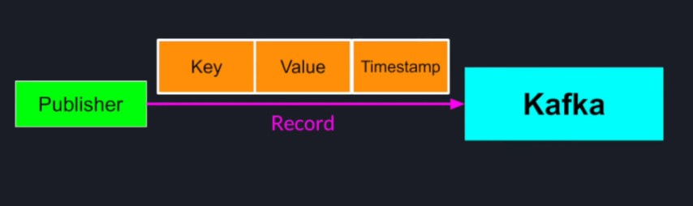
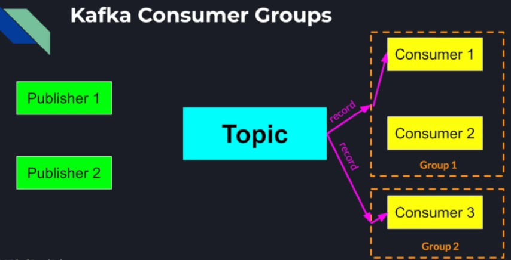

## Apache Kafka

* Apache Kafka is open source and provides:
    * Distributed Queuing
    * Publish/Subscribe capabilities
* Beautifully designed Distributed System for high scalability and fault tolerance
* Distributed Streaming Platform, for exchanging messages in realtime between different servers
* Can be described as a Message Broker on a high level
* Internally Kafka is a distributed system that may use multiple message brokers to handle the messages

### Apache Kafka architecture, topics and partitions

**Apache Kafka's Producer Record** <br />
 <br />
The message we want to publish to Kafka comes inside a record that consists of a Key, Value which is our message and a
Timestamp

**Kafka Abstraction - Topics** <br />
 <br />
The center of the abstraction that Kafka provides is the topic, we can think of topic as a category of messages or
events. Publishers can publish records to any topic and subscribers can consume records from any topic.

**Topics and Partitioned Logs** <br />
 <br />
Instead of having a monolithic log or queue for each topic, Kafka allows us to partition each topic into multiple logs
that really look like arrays of records. Whenever a new record is published to a topic, it is appended to one of those
partitions and is assigned a sequence number in an increasing order. Each such sequence number is called an offset. We
can think of a topic as a collection of ordered queues where each partition is a separate independent queue of records.
Each partition maintains the messages in the order they were published however there is no global ordering between the
messages inside the topic.

**Kafka Keys and Partitions** <br />
 <br />
The partition to which a record is appended depends on the key the publisher sets in the record. More precisely a hash
function is applied on the records key and that determines where that record would go.

**Kafka Scalability through Partitioning** <br />
Kafka Topic partitioning allows us to scale a topic horizontally. More partitions in a topic -> higher parallelism.

**Kafka Partitioning - Online Store** <br />
 <br />
For example, The Purchases Topic in an online store gets a lot of messages. So it can spread those messages across a
larger number of partitions. <br />
 <br />
Purchases from different users are not related to each other so maintaining the order of may not be very important. So
we can use the userId as the key for the record. This way we can spread all the purchasing events across all the
partitions. On the other hand order of events from the same user is important. For example, a user may purchase an item
and then immediately ask for a refund for the same item. And because they key which is the userId for both messages is
the same, the records for both those events will go to the same partition and will be consumed in the correct
order. <br />
 <br />
In the same time, Topics that receive fewer messages can have fewer partitions. Or if the order is always important in
all cases we can even have only one partition per topic.

### Consumer Groups, Distributed Queue and Pub/Sub

**Kafka Consumer Groups** <br />
 <br />
In order for an application instance to consume messages from a Kafka topic, a consumer has to belong to a consumer
group. When consumers subscribe to a topic each message is delivered to a single instance in a consumer group.

**Kafka as a Distributed Queue** <br />
 <br />
So if the processing of the published messages is complex, we can place multiple consumer instances in a group and the
messages to our topic will be load balanced among all the consumers within that group.

**Kafka as a Publish/Subscribe system** <br />
 <br />
We can place each consumer in a different consumer group which means every message published to a topic will be
delivered to all the consumers.

### Kafka Performance and Scalability

**Kafka Brokers & Topic Partitions** <br />
 <br />
A naive implementation of a message broker would be to have a single instance managing a topic running on a single
machine. In this approach, aside from the message broker being a single point of failure, there is no way to
horizontally scale our topic. The message brokers parallelism is limited by the number of cores on the machine and the
entire topic has to fit on a single computers' memory. <br />
 <br />
That's why Kafka allows us to divide a topic into multiple partitions instead of just having one monolithic topic. This
way we can launch more broker instances on separate machines and distribute a topic across those brokers by splitting
the partition ownership equally among them. Of-course we lose the global ordering of the messages within the topic and
have to compromise on ordering only within each partition. That is a trade-off we pay of achieving high
scalability. <br />
 <br />
We could initially start with a large number of partitions and a few brokers and add new brokers as necessary to spread
the load of the messages published to that topic. This is a good practice if we start with a small load but anticipate
to grow it over time. <br />
_So essentially from a publisher perspective:_

* Number of partitions in a topic ~= maximum unit of parallelism for a Kafka Topic
* We can estimate the right number of partitions for a topic given our expected peak message rate/volume for every topic
  in the system
* By adding more message brokers we can increase the Kafka topics' capacity, transparently to the publishers.

**Consumers & Topic Partitions** <br />
 <br />
From a consumption point of view, Kafka partitions are divided among the consumer instances within each consumer group.
This way each consumer instance handles a fair share of the topic partitions. And as we add more consumers into the
group, the share of partitions each consumer has to consume from gets smaller.

_Thanks to the partitioning of a Topic:_

* We can have many broker instances working in parallel to handle incoming messages
* And having many consumers, consuming in parallel from the same topic

### Kafka Fault Tolerance

If one broker instance fails we can lose the entire partition with all its data. So each Kafka Topic is configured with
a replication factor. A replication factor of N means each partition of the topic is replicated by N Kafka brokers. For
each partition, only one broker acts as a partition leader, other brokers are partition followers. The leader takes all
the reads and writes to and from that partition. The followers replicate the partition data to say in sync with the
leader and are passively standing ready to replace the leader if the leader fails. <br />
**For Example**:- <br />
 <br />
With a topic with 4 partitions managed by 4 brokers and a replication factor of two, each partition will be replicated
to two different brokers. And for each partition there would be only one broker that acts as a leader and will handle
all the writes and reads. And one follower for backup that would stay in sync leader at all times and be ready to take
over if needed. <br />
The higher replication factor the more failures our system can tolerate. But more replication means more space is taken
away from the system just for redundancy. The replication is configured on per topic basis. Kafka tried its best to
spread the partitions and leadership fairly among the brokers for maximum efficiency. Kafka is using Apache Zookeeper
for all its coordination logic. Kafka is using Zookeeper as a registry for brokers to publish the information about
their address as well as the topics they manage, as well as for monitoring and failure detection using the techniques
like ephemeral znodes and watchers. <br />
 <br />
Kafka persists all its messages on disk. Even after messages are consumed by the consumers, the records still stay
within Kafka partitions for a configurable period of time. This not only allows new consumers to join and consume older
messages, but it also allows the consumers that failed in the process of reading/processing a message to retry the
operation without losing any data. Failed brokers can recover and resume their operation almost instantaneously and
catch up with the rest of the cluster very fast.

**Question 1:** <br />
We have a large Restaurant Distributed System with multiple Consoles where waiters can place their customers' orders.
The orders go to a cluster of Kafka Brokers with 2 topics. Topic 1 has two partitions Topic 2 has only one partition

 <br />
Customers usually come very hungry. If party A placed an order before party B, but party B received their food before
party A. The customers of party A would get furious. However after the meal, customers that order beverages, usually
don't care about the time order of delivery. Which Kafka Topic should be the Kitchen, and Which Kafka Topic should be
the Bar? <br />
Topic 1 - Bar <br />
Topic 2 - Kitchen <br />
The order of messages is retained only within a single partition, so a topic with one partition is more suitable for the
Kitchen service rather than the bar.

**Question 2:** <br />
We are building a Banking Service. In this service, bank transactions are placed by users, and are sent to our Kafka
Transactions Topic. <br />
 <br />
We want to make sure that each transaction is consumed by the Account Service, as well as logged by the Transaction
Logging Service, for reporting and auditing purposes. How should we configure our consumer services? <br />
We should place each consumer (Account Service and Transaction Logging Service) into a separate consumer group. This way
each message in the Transactions' topic will be delivered to each of the consumers. This is equivalent to pub/sub
pattern.

**Commands** <br />

```Shell
./zookeeper-server-start.sh ../config/zookeeper.properties
./kafka-server-start.sh ../config/server.properties
./kafka-topics.sh --create --bootstrap-server localhost:9092 --replication-factor 1 --partitions 1 -topic chat
./kafka-topics.sh --list --bootstrap-server localhost:9092
./kafka-console-producer.sh --broker-list localhost:9092 --topic chat
./kafka-console-consumer.sh --bootstrap-server localhost:9092 --topic chat --from-beginning
```

**Summary**:- <br />

1. Topic partitioning allows us:
    * Scale a topic horizontally across multiple brokers and multiple machines
    * Redundancy and replication allows us to achieve fault tolerance
2. Persistence to disk enables log replays, as well as fast Kafka brokers' recovery
