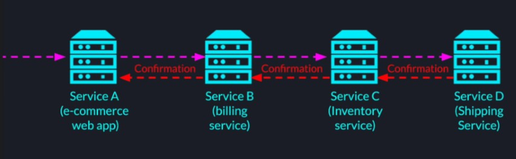

## Message Brokers

**Synchronous Network Communication** -  
One of the properties of direct network communication is that its inherently synchronous. In this case we are not
referring to the internal threading model or the network API used by the servers, but to the fact that throughout the
entire data transfer both the server and client have to be present and maintain a connection with each other.  
**Synchronous Network Communication Through Load Balancers** -  
And even if the servers are part of different logical clusters or if they communicate with each other through a load
balancer, both the servers have to maintain a TCP connection to each other or to the load balancer all the way from the
first byte of the http request to the last byte of the http response.

**Synchronous Communication example**  
_Financial Event Pipeline_  
  
Service A is an online store web application which receives a purchase request from a user, then to complete the
purchase we have to withdraw the money from the users account. So Service A would call the Service B which is the
billing service that connects to different credit card companies and banks. After the money has been withdrawn from the
user, we need to update the inventory of the product to make sure multiple users would not buy the same item. So Service
B will pass the request to Service C which is the inventory service. Finally, we need to request the shipment of the
item to the users address so Service C will call the shipping service, Service D.  
Service A cannot confirm the purchase until Service B sends back a confirmation and Service B would not send that
confirmation until it gets the response from Service C and Service C would not send the confirmation until it gets the
response from Service D. The reason for this chain of dependencies is for example if Service A responds before it gets
confirmation from Service B but then Service B crashes and doesn't bill the user, the user will get a false confirmation
about an order he will never receive. Alternately if Service B sends back the confirmation after billing the user but
before a response from Service C arrives, and Service C fails. The user will end up paying for a product that he will
never receive.  
So Inevitably we are holding the user for a long time until we can safely send the confirmation and the longer we keep
the connections, the more chances are that one of them will actually break.

**Broadcasting Event to Many Services**  
In this scenario, one of our servers wants to broadcast an event to many services that are interested in receiving it.
The problem with this scenario is that the more servers wants to receive the event, the more direct connections the
publisher server will have to open. So this approach just would not scale.

**Traffic Peaks and Valleys**  
When the traffic to our systems has drastic peaks during which our system just cannot handle the incoming events all at
once. Example if we have a social media distributed system where sometimes there is a live event during which millions
of users comment all at once. During that time our analytics backend service may not keep up with the rate of events and
would simply crash. So having some sort of queue where we could store all those events in order temporarily would
definitely help to solve the problem.

