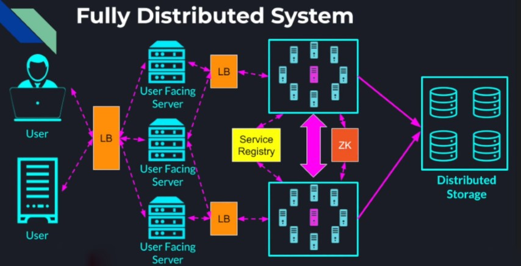
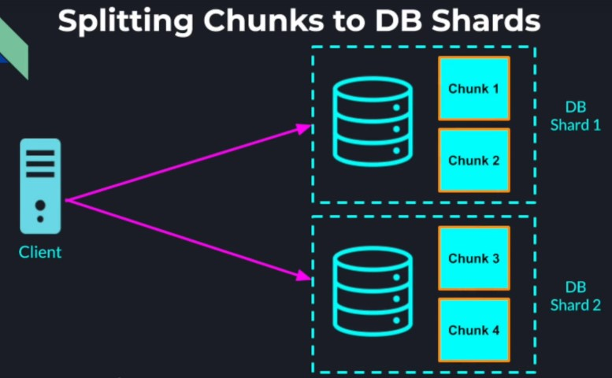
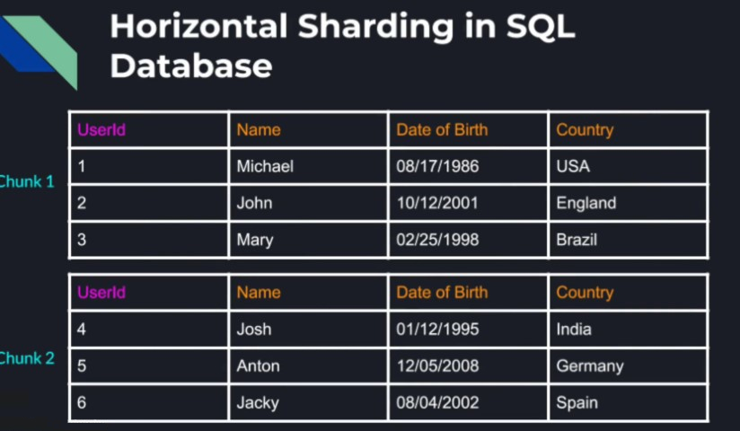
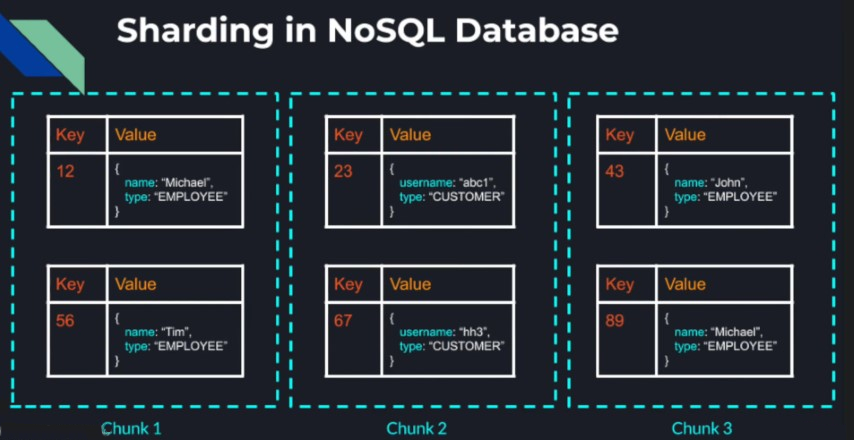
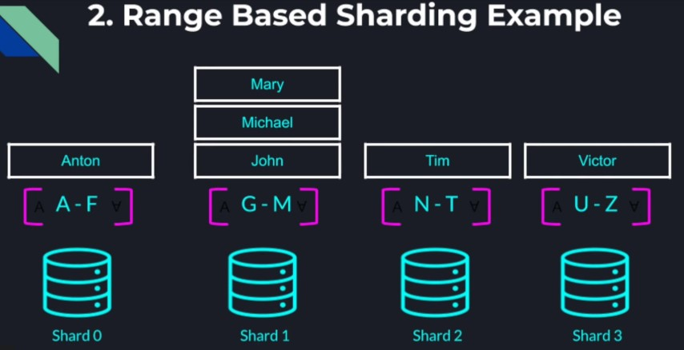
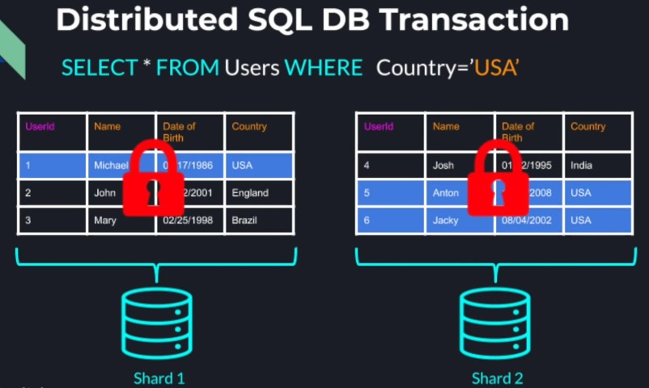
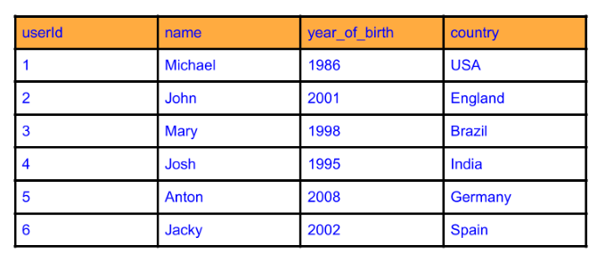

## Distributed Storage

We already know how to scale user facing service using techniques like load balancing and replication. We also have a
lot of techniques to scale our internal systems such as using coordination systems, service registries, load balancers,
message brokers and others. So to make our system completely distributed, scalable and fault-tolerant, we need to add
the same properties to our storage layer.  
**Storage options:-**  
We can store our data in

* File System
    * A lower level, general purpose approach to storage of data of any format, structure or size
    * Best for unstructured data, or data with no relationship to other data
    * Examples:
        * Video files
        * Audio files
        * Text files
        * Memory logs
    * If we need more advanced operations on the data, we should consider using a database.
* Database
    * A Database is a higher level abstraction
    * An application that provides additional capabilities (query language/engine), caching and performance
      optimizations
    * Provides restrictions on structure, relationship and format
    * Guarantees ACID Transactions
        * Atomicity
        * Consistency
        * Isolation
        * Durability
    * Database are easy to build and replace than specialized distributed file system

**Types of Database**

* Relational Databases (SQL) - Data is structured as tables(rows and columns)
* Non-Relational database (NoSQL) - Less structured data
    * Key/Value pairs
    * Key/Document pairs
    * Graph Databases

**What we want from a Database**

* Availability
* Scalability
* Fault Tolerance

Just like any distributed system. A centralized database cannot achieve those characteristics.

_Centralized Database Issues_  

* Single point of failure
    * Losing a database is a lot worse than losing a compute node.
    * Temporary failure to operate the business while the database instance is unavailable
    * Risk losing all the data permanently
    * Compute nodes can easily be restored
    * Permanent data loss can be detrimental to the business
* Performance Bottleneck
    * Parallelism is limited to the number of cores in the machine
    * Limited connections the OS and network card can support
    * Minimum latency depends on the geographical location of the database instance and the user
    * If we want to store all or part of the data in memory to speed up the operations we are also limited to the memory
      a single machine can have.

So to achieve a fully distributed system we are going to attempt to distribute our data across multiple physical nodes
to guarantee full system availability scalability and fault tolerance.

### Data Sharding

Sharding - Partitioning a large dataset into multiple smaller chunks of data called shards. Using sharding we can split
a large database into smaller pieces living on different machines. Thanks to sharding, each database instance can
provide lower latency as it can fit all it's data in the memory. Also, it can provide higher throughput through
parallelism when data transactions operate on data from different shards. Through sharding we can scale a database
horizontally by adding more and more database instances as the amount of data increases. We can also provide higher
availability since if one of the database instances goes down, other shards remain unaffected and are available for
clients to read and write to.  

**Sharding in SQL Database**

* Vertical Sharding in SQL Database - Splitting the table into smaller chunks that contain fewer columns.
* Horizontal Sharding in SQL Database - More scalable and adaptive way to shard a table is splitting the table records
  into separate chunks each containing a subset of the records.

**Sharding in NoSQL Database**

Simply divide the already disjointed records into groups and place each group in a different shard.

In either case each chunk of records can now live on a different database instance called shard and each database shard
can potentially contain multiple chunks of records.

**Sharding based on records key**

* Sharding is done based on the records key
* The key determines in which shard
    * To find an existing record
    * To add a new record with a new key

### Sharding Strategies

#### Hash based sharding

A hash function takes the record's key and generates a numeric hash value out of it. The hash value is used to determine
which shard the record belongs to.
**Example**

<pre>
Key: userID 
Number of shards: N 
Hash Function: f(key) = key mod N
</pre>

<pre>
Key: userID = 1000
Number of shards: N = 3
Hash Function: f(1000) = 1000 mod 3 = 1
This record will go to shard 1
</pre>

<pre>
Key: userID = 1001
Number of shards: N = 3
Hash Function: f(1001) = 1001 mod 3 = 2
This record will go to shard 2
</pre>

<pre>
Key: userID = 1002
Number of shards: N = 3
Hash Function: f(1002) = 1002 mod 3 = 0
This record will go to shard 0
</pre>

**Advantage**

* With monotonically increasing keys and a good hash function, we can achieve even data distribution among the database
  shards.

**Disadvantage**

* Keys with "close" values will likely not fall in the same shard
* Range based queries will span multiple shards.

#### Range based sharding

* In range based strategy we divide the keyspace into multiple contiguous ranges
* Records with nearby keys will more likely end up in the same shard
* Range based queries will be a lot more efficient

**For example:-**
If we take a users table and pick name as the sharding key, we can allocate an alphabetic range to each shard and
records with names with the same or close by letter will end up in the same shard. Similarly, we could shard by the
users DOB or country if the range queries that normally run are more relevant to those attributes. Disadvantage of range
based sharding is if our keyspace is clustered in certain ranges, we will not get even data distribution among our
shards. We might need to readjust the ranges on a continuous basis to guarantee good data distribution within our
distributed database.

**Sharding Disadvantages**

* Operations that involve records that reside on different shards became much more complex
* Concurrency control becomes much harder and more expensive than in a centralized database.
    * Centralized DB Transaction - All the data is in one table, on one database instance. Easy concurrency control -
      Acquiring local locks on a table or multiple tables to guarantee data consistency. So it simply boils down to
      acquiring local locks within a single process.
    * Distributed SQL DB Transaction - If the same table is sharded across multiple machines, simple queries become
      distributed transactions where we need to potentially acquire distributed lock which is lot more complicated,
      error-prone and has much higher performance penalty.  
      

* Some Relational databases do not even support automated sharding and are generally a lot harder to scale. This is one
  of the reasons for the rise in popularity of NoSQL Databases(DynamoDB, Cassandra, MongoDB, Redis, etc), which are not
  designed for complex multi record queries like SQL databases. Therefore, NoSQL Databases do not guarantee the same
  Atomicity, Consistency, Isolation and Durability (ACID) like a SQL DB would.

**NoSQL Databases Advantages and Disadvantages**

* Some NoSQL Databases guarantee atomic operations on multiple records only on records that reside on the same physical
  node.
* Some NoSQL Databases do not guarantee strict consistency and some do not even guarantee atomicity of operations on
  multiple records at all.
* NoSQL Databases are easier to shard and scale but designing a system with NoSQL Databases is more challenging.

_Question 1_  
What is the benefit of sharding a data set across multiple database nodes?
> Sharding allows us to spread the data across a larger number of computers. This way we can scale our database horizontally as the number of records grows.

_Question 2_  
We are tasked with helping to scale a relational database of a large organization that provides service to millions of
users. The relational database contains the following Users Table, that is now so big that it does not fit on one
machine.  

Assumptions:

1. Our Relational Database allows us to shard the table by any column
2. Writes are very infrequent
3. Most table reads are queries for users that were born in a given period of time
   (for example SELECT * FROM Users WHERE year_of_birth < 2000 AND year_of_birth > 1990)

Given that we would like to provide the best query performance and best resources' utilization  
Which column should we shard our table on? Which Sharding strategy should we use?

> We should shard on the year_of_birth column and use the Range Based Sharding Strategy. This way our table is going to be broken into smaller tables where users will more likely be born on the same or close by year.

