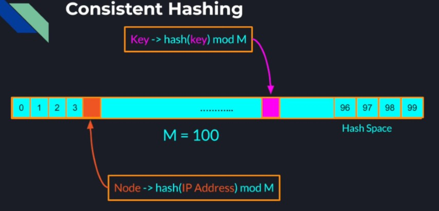

## Distributed Storage

We already know how to scale user facing service using techniques like load balancing and replication. We also have a
lot of techniques to scale our internal systems such as using coordination systems, service registries, load balancers,
message brokers and others. So to make our system completely distributed, scalable and fault-tolerant, we need to add
the same properties to our storage layer.  
**Storage options:-**  
We can store our data in

* File System
    * A lower level, general purpose approach to storage of data of any format, structure or size
    * Best for unstructured data, or data with no relationship to other data
    * Examples:
        * Video files
        * Audio files
        * Text files
        * Memory logs
    * If we need more advanced operations on the data, we should consider using a database.
* Database
    * A Database is a higher level abstraction
    * An application that provides additional capabilities (query language/engine), caching and performance
      optimizations
    * Provides restrictions on structure, relationship and format
    * Guarantees ACID Transactions
        * Atomicity
        * Consistency
        * Isolation
        * Durability
    * Database are easy to build and replace than specialized distributed file system

**Types of Database**

* Relational Databases (SQL) - Data is structured as tables(rows and columns)
* Non-Relational database (NoSQL) - Less structured data
    * Key/Value pairs
    * Key/Document pairs
    * Graph Databases

**What we want from a Database**

* Availability
* Scalability
* Fault Tolerance

Just like any distributed system. A centralized database cannot achieve those characteristics.

_Centralized Database Issues_  

* Single point of failure
    * Losing a database is a lot worse than losing a compute node.
    * Temporary failure to operate the business while the database instance is unavailable
    * Risk losing all the data permanently
    * Compute nodes can easily be restored
    * Permanent data loss can be detrimental to the business
* Performance Bottleneck
    * Parallelism is limited to the number of cores in the machine
    * Limited connections the OS and network card can support
    * Minimum latency depends on the geographical location of the database instance and the user
    * If we want to store all or part of the data in memory to speed up the operations we are also limited to the memory
      a single machine can have.

So to achieve a fully distributed system we are going to attempt to distribute our data across multiple physical nodes
to guarantee full system availability scalability and fault tolerance.

### Data Sharding

Sharding - Partitioning a large dataset into multiple smaller chunks of data called shards. Using sharding we can split
a large database into smaller pieces living on different machines. Thanks to sharding, each database instance can
provide lower latency as it can fit all it's data in the memory. Also, it can provide higher throughput through
parallelism when data transactions operate on data from different shards. Through sharding we can scale a database
horizontally by adding more and more database instances as the amount of data increases. We can also provide higher
availability since if one of the database instances goes down, other shards remain unaffected and are available for
clients to read and write to.  

**Sharding in SQL Database**

* Vertical Sharding in SQL Database - Splitting the table into smaller chunks that contain fewer columns.
* Horizontal Sharding in SQL Database - More scalable and adaptive way to shard a table is splitting the table records
  into separate chunks each containing a subset of the records.

**Sharding in NoSQL Database**

Simply divide the already disjointed records into groups and place each group in a different shard.

In either case each chunk of records can now live on a different database instance called shard and each database shard
can potentially contain multiple chunks of records.

**Sharding based on records key**

* Sharding is done based on the records key
* The key determines in which shard
    * To find an existing record
    * To add a new record with a new key

### Sharding Strategies

#### Hash based sharding

A hash function takes the record's key and generates a numeric hash value out of it. The hash value is used to determine
which shard the record belongs to.
**Example**

<pre>
Key: userID 
Number of shards: N 
Hash Function: f(key) = key mod N
</pre>

<pre>
Key: userID = 1000
Number of shards: N = 3
Hash Function: f(1000) = 1000 mod 3 = 1
This record will go to shard 1
</pre>

<pre>
Key: userID = 1001
Number of shards: N = 3
Hash Function: f(1001) = 1001 mod 3 = 2
This record will go to shard 2
</pre>

<pre>
Key: userID = 1002
Number of shards: N = 3
Hash Function: f(1002) = 1002 mod 3 = 0
This record will go to shard 0
</pre>

**Advantage**

* With monotonically increasing keys and a good hash function, we can achieve even data distribution among the database
  shards.

**Disadvantage**

* Keys with "close" values will likely not fall in the same shard
* Range based queries will span multiple shards.

#### Range based sharding

* In range based strategy we divide the keyspace into multiple contiguous ranges
* Records with nearby keys will more likely end up in the same shard
* Range based queries will be a lot more efficient

**For example:-**
If we take a users table and pick name as the sharding key, we can allocate an alphabetic range to each shard and
records with names with the same or close by letter will end up in the same shard. Similarly, we could shard by the
users DOB or country if the range queries that normally run are more relevant to those attributes. Disadvantage of range
based sharding is if our keyspace is clustered in certain ranges, we will not get even data distribution among our
shards. We might need to readjust the ranges on a continuous basis to guarantee good data distribution within our
distributed database.

**Sharding Disadvantages**

* Operations that involve records that reside on different shards became much more complex
* Concurrency control becomes much harder and more expensive than in a centralized database.
    * Centralized DB Transaction - All the data is in one table, on one database instance. Easy concurrency control -
      Acquiring local locks on a table or multiple tables to guarantee data consistency. So it simply boils down to
      acquiring local locks within a single process.
    * Distributed SQL DB Transaction - If the same table is sharded across multiple machines, simple queries become
      distributed transactions where we need to potentially acquire distributed lock which is lot more complicated,
      error-prone and has much higher performance penalty.  
      

* Some Relational databases do not even support automated sharding and are generally a lot harder to scale. This is one
  of the reasons for the rise in popularity of NoSQL Databases(DynamoDB, Cassandra, MongoDB, Redis, etc), which are not
  designed for complex multi record queries like SQL databases. Therefore, NoSQL Databases do not guarantee the same
  Atomicity, Consistency, Isolation and Durability (ACID) like a SQL DB would.

**NoSQL Databases Advantages and Disadvantages**

* Some NoSQL Databases guarantee atomic operations on multiple records only on records that reside on the same physical
  node.
* Some NoSQL Databases do not guarantee strict consistency and some do not even guarantee atomicity of operations on
  multiple records at all.
* NoSQL Databases are easier to shard and scale but designing a system with NoSQL Databases is more challenging.

_Question 1_  
What is the benefit of sharding a data set across multiple database nodes?
> Sharding allows us to spread the data across a larger number of computers. This way we can scale our database horizontally as the number of records grows.

_Question 2_  
We are tasked with helping to scale a relational database of a large organization that provides service to millions of
users. The relational database contains the following Users Table, that is now so big that it does not fit on one
machine.  

Assumptions:

1. Our Relational Database allows us to shard the table by any column
2. Writes are very infrequent
3. Most table reads are queries for users that were born in a given period of time
   (for example SELECT * FROM Users WHERE year_of_birth < 2000 AND year_of_birth > 1990)

Given that we would like to provide the best query performance and best resources' utilization  
Which column should we shard our table on? Which Sharding strategy should we use?

> We should shard on the year_of_birth column and use the Range Based Sharding Strategy. This way our table is going to be broken into smaller tables where users will more likely be born on the same or close by year.

#### Dynamic Sharding with Consistent Hashing

In the regular hash based strategy, we have N database shards or instances, and we need to allocate each record to a
particular shard by applying a hash function on the records key modulo N (Shard = H(key) mod 4). What happens if we want
to add another server to our database cluster. In this case the formula we used to allocate a record to a particular
shard changes, so now queries from clients that look for a particular record by its key will not find the record in the
right shard. And all the existing records will have to move to the right location according to the new sharding formula.
And the same thing would happen if we want to remove a node from the cluster, we have to reshuffle a large number of
keys not only from the node that is going to be removed but also from other nodes as well.  

The second problem is if not all the nodes in our cluster have the same capacity or CPU capabilities, in this case we
would like to allocate more records to the more powerful nodes that maybe have more memory and can handle more
concurrent reads while allocating fewer records to maybe older or less powerful nodes to make sure they don't crash.
However, there is no way for us to achieve this using the standard hashing method.  
To address these limitations of the regular hashing algorithm, we are going to introduce a new hashing algorithm
designed specifically for such scenarios.

**Consistent Hashing**  

The idea of consistent hashing is to hash not only the keys but also the nodes, and more importantly hash them all to
the same hash space. We can use the nodes IP address or any other unique identifiers as keys to use in the hash
function. In addition to hashing both the records keys and the nodes to the same space, we make the hash space
continuous by turning it into a ring. All the keys whose values fall between particular nodes value and the previous
nodes position on the ring belong to that particular node.  

  

For example, a key that falls into the 31st slot in the ring belongs to node 1 and will be stored on that node. And a
key that maps to slot 57 on the ring will also reside on node 1. However, a key that maps to slot 58 will already belong
to node 5 and all the keys that fall between slot 99 and slot 2 will be stored on node 2.  

**Consistent Hashing Capabilities**

* Uniform records distribution among all the distributed database nodes
* But we already had that in the simple hashing strategy!
* Consistent hashing allows us to dynamically add and remove nodes from the cluster without re-assigning too many keys
  and hence moving fewer records. For example if we want to remove node 2 from the cluster all we need to do is assign
  all the values in the ring that used to belong to that node to the next node, node 1. This way all the records that
  used to reside on node 2 will be moved to node 1 and the rest of the records in the entire cluster remain
  untouched.  
    
  Similarly, if we want to add a new node to the cluster whose hash value falls in slot 31, only the records in node 1
  that hash to value between 99 and 31 will have to be moved to the new node. And again, other records with keys that
  hash outside the new nodes boundaries will remain untouched.
* Consistent Hashing - Virtual Nodes
    * 
    * If some physical nodes are more powerful/have more capacity than other nodes, we can assign the stronger nodes
      more keys.
    * Method:
        * Map each physical node -> one or more virtual nodes
        * More powerful physical nodes -> many virtual nodes
        * Weaker/Smaller physical nodes -> single or fewer virtual nodes
    * We can build robust database clusters with existing hardware with no need for additional expenses.
    * For example, if we have 3 physical nodes however node 1 twice as powerful as node 0 and node 2 is 3 times as
      powerful as node 0. We can map node 0 to 1 virtual node, node 1 to 2 virtual nodes and node 2 to 3 virtual nodes.
      And now statistically there is a higher chance for a key to belong to node 2 than to node 1. And there is a higher
      chance for a key to belong to node 1 than to node 0.

**Consistent Hashing with multiple hash functions**  

Because we have just a small number of nodes, we may end up in a situation where after applying a hash function, for
example on our cluster nodes IP addresses, a disproportionally large portion of the hash space values map to one of the
nodes and a disproportionally small portion is allocated to another node. Statistically this means that much more
records will end up in node 1 than in node 0. This type of uneven load distribution can make node 1 a performance
bottleneck while leaving node 0 underutilized.  

The solution to such an unlucky hash function result and an uneven load distribution is not use not one but multiple
hash functions on each node. Using multiple hash functions, each node will be mapped to multiple locations on the hash
space ring. We create an illusion of having more nodes than we actually have. Statistically it distributes the load more
evenly among the physical nodes.  

For example, with 3 nodes and this time we will use not one but two hash functions for each of those nodes. Using the
first hash function, we map node 0 to slot 99, node 1 to slot 60 and node 2 to slot 65. Now if we stopped right here, we
already see that node 1 has way more keys to handle than node 2. However now we repeat the same process with hash
function number 2 which maps node 0, node 1 and node 2 to different slots since it's a different mathematical
transformation. And now if we look at the keys' allocation on the nodes, we have a much better picture. Now each node
has a portion of the keys from different ranges and there is less chance that a single node will be disproportionally
overloaded or underutilized.  

**Summary**  

* Using consistent hashing we mapped database records and DB shards (database instances) to the same hashing space
* This allowed us to scale our distributed DB both up and down with minimal impact on other nodes and records.
* We were able to address the capacity imbalance in our cluster and design a scalable sharded distributed DB with a mix
  of servers with different hardware capabilities.
* We used multiple hash functions to achieve a better load distribution and avoid performance bottlenecks in our
  distributed database.

_Question_
Consistent Hashing is a technique to map both the keys of our data and the database nodes that store that data to the
same hash space. What is the benefit of doing so?

* Using consistent hashing we can dynamically add and remove database nodes from our database cluster, without
  reallocating all the keys to the new set of nodes.
* Using consistent hashing we can allocate more keys to some database nodes and fewer keys to other nodes (using the
  virtual nodes' technique).
* Using consistent hashing we can spread the keys of our data more evenly across the database nodes (by using multiple
  hash functions)

### Database Replication, Consistency Models & Quorum Consensus

#### Replication vs Sharding
| Sharding                                                           | Replication                                                                               |
|--------------------------------------------------------------------|-------------------------------------------------------------------------------------------|
| _Splitting_ the data and placing each chunk on a different machine | Creating identical _copies_ of all the data, and placing each copy on a different machine |
| _No_ redundancy                                                    | _Full_ redundancy                                                                         |

**Motivation - High Availability**  
First and the biggest reason why we want to replicate our data in a distributed database is to achieve high
availability. If we store all our data on a single machine and the communication to that machine breaks down, for
example due to a router failure, our business will not be able to operate until that node becomes available again. So if
we keep copy of all our data on a separate machine, then if the main database instance or master is unavailable, we can
still have access to the data residing on the replica and our business can continue operating.

**Motivation - Fault Tolerance**  
If this time it's not the router that failed but the database instance disk or cpu, then having the data in one place
will result in a complete and unrecoverable data loss. So having a copy of our data on a different machine serves as a
backup to ensure we never lose any of our data.

**Motivation - Scalability/Performance**  
Data replication particularly shines in a read intensive work load. For example, if we have a relatively small dataset
that can fit on a single instance, but we have a very large number of clients that read data from the database, a single
node will just not be able to handle such a large number of concurrent reads. So through full data replication, the load
on each replica is much smaller, and we can support a much higher throughput and number of concurrent readers. Handling
concurrent writes to a replicated database is a bit more complex.

#### Replicated Database Architectures

**Master - Slave Architecture**

In this architecture, all the write operations go to the master and the read operations go to the slave. Every write
operation to the master is propagated to the slave so that the slave always contains an identical copy of the data on
the master. And if the master fails for any reason, the slave is ready to take over and assume the role of the master to
keep the system running. At some point a single writer is no longer enough for us, so we move to the master-master
architecture.

**Master - Master Architecture**

Each node can take both reads and writes and every write is propagated to other nodes for consistency. In this
architecture, all the nodes are identical in their role, and we can grow our database cluster to as many nodes as
necessary.

#### Database consistency models

**Master - Slave architecture - writes**

If a particular client writes to the master and gets an acknowledgment before the write was propagated to the replica
and then reads the same record immediately it will see an old value. This situation makes our database temporarily
inconsistent. However, eventually the new value will be propagated to all the replicas and our database will become
consistent again.

_Eventual Consistency_

* In this model, if no further updates are made, eventually all readers will have access to the newest data.
* However temporarily some readers may see stale data.
* Provides lower latency and higher availability. Since we can respond to reads and acknowledge writes without waiting
  for an update to propagate to the entire cluster.
* Good choice for systems that do not need to have the most up-to-date data across the board.
* Examples:
    * Posts/Updates to social media profile
    * Analytics for product rating and number of reviews

_Strict Consistency_

* We can force strict consistency by forcing the writer to wait until the master finishes replicating the new value to
  the slave before the writer can assume that write was successful. This guarantees strict consistency but slows down
  the write operations.
* In Strict consistency, the writer will not get an acknowledgement that the write is successful until we can guarantee
  that all the readers will see the new data.
* Slows down operations and limits system's availability (if some replicas are temporarily not accessible)
* Essential for systems that need to be consistent across all the services
* Examples:
    * User's account balance
    * Number of items in a store's inventory
    * Available/Booked seats in a theater

We were able to force strict consistency in a simple 2 node master-slave architecture however how would we do it in a
fully distributed and symmetric master-master architecture where each node can take both reads and writes.

**Strict Consistency - Attempt 1**  
We can try to force each write to wait until the data propagates to all the nodes as before but that is very
problematic. In the best scenario, it is just going to be a very slow write. But in the worst scenario, the write will
time out if just one node of our many nodes is currently unavailable.

#### Quorum Consensus

A more methodical solution to guarantee strict consistency is using the quorum consensus. First each records in our
database in addition to the key and the records' data will also have a version. Every update to a record increments the
version number to make sure we can distinguish between an older record and a newer record.

**Quorum Consensus - Definitions**  
**R** - _Minimum_ number of nodes a _reader_ needs to read from  
**W** - _Minimum_ number of nodes a _writer_ needs to write to  
**N** - Number of nodes in the database cluster

> R + W > N  (Guarantees Strict Consistency)

What the Quorum Consensus protocol dictates is if we chose R and W such that their sum is strictly greater than the
number of nodes we have in the cluster (N), we are guaranteed to have a strict consistency in our distributed database.
For example, if the number of nodes in our cluster is 5, and we chose the minimum number of nodes to read from to be 3
and the minimum number of nodes to write to also be 3. Then we are guaranteed to have strict consistency because  
<pre>
N = 5
R = 3
W = 3
R + W > N
3 + 3 > 5
</pre>

However, if we chose the minimum number of nodes to read from to be 2 then we will only have eventual consistency in our
database
<pre>
N = 5
R = 2
W = 3
R + W > N
2 + 3 !> 5
</pre>

The idea of Quorum is very simple, and it simply guarantees an overlap between the reads and the writes. For example:-
<pre>
N = 5
R = 3
W = 3
R + W > N
3 + 3 > 5
</pre>

A client wants to update the record X to a new value of 20, so it needs to pick 3 nodes to write to. So once it writes
to the quorum of 3 nodes and updates the version of the record on those nodes, the write operation is considered
successful.  

Now if a reader wants to read from record X, since we chose the values of R and W so that their sum is greater than N,
in the most unlucky pick of a read quorum of 3 the reader is still guaranteed to have an overlap with the recent write
operation. When the reader gets the values and the versions of the records, the reader can see that the values do not
match. At this point the reader can see that the version of X = 20 is more recent than the version of X = 10. Which must
mean that 20 is the most up-to-date value of X.

**Quorum - Optimizing for reads**

To optimize our database for reads, we can choose R to be 2 and W to be 4. With this choice, we still guarantee strict
consistency and in the worst case we still have an overlap between past writes and newer reads. However now the readers
needs to pick only 2 nodes to read from which makes the readers faster on the expense of the slower writes that now need
to write to at least 4 different nodes.  

If we pick R and W right we even have high availability since we have room for some nodes to fail. For example, If we
use the same values for R and W as before (R = 2, W = 4, N = 5), the read clients still have enough nodes to choose from
to achieve a read quorum of 2. And the write clients still have enough nodes to pick for a write quorum of 4.  

**Quorum Consensus - Over Optimization**

However, if we go too far with optimizing for reads for example (R = 1, W = 5, N = 5), and we choose the read quorum to
be 1, that forces to us to have at least 5 write nodes in the write quorum. That allows the read client to read from
only one node and get the most up-to-date value but does not leave us any room for nodes to fail since a successful
write needs the entire cluster to be available.

**Summary**

* Data replication in distributed databases
* Data replication architectures:
    * Master - Slave architecture (Write operations only go to one node and read operations go to the slave replicas)
    * Master - Master architecture (All the nodes are identical and both read and write operations can go to any of the
      nodes)
* Consistency Models
    * Strict Consistency
    * Eventual Consistency
* Quorum Consensus - To guarantee strict consistency in any replication architecture.
    * Optimizing for reads or writes
    * Choosing R and W for high availability
* When building a Distributed Database we don't need to choose between
    * Replication
    * Sharding
* Most Distributed Databases use a combination of both _sharding_ and _replication_ to achieve
    * High Scalability
    * Availability
    * Fault Tolerance