## MongoDB


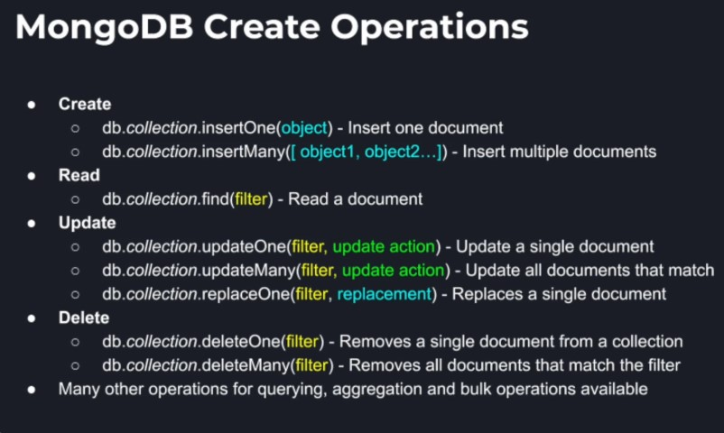

### MongoDB Replication Sets

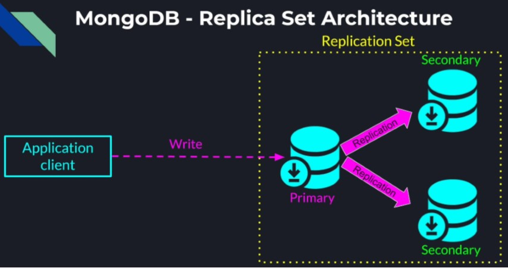

By default, we launch a single mongodb instance which contained all of our data. And our application client (mongo
shell) connected, wrote and read all the data from that single node. To provide redundancy for data availability and
resilience to failures of individual nodes, we are going to replicate our data by launching multiple mongod instances. A
group of mongod instances that contain the same data is called a replication set. <br />
In a replication set there is one node that is the primary and rest of the nodes are considered secondary which is a
variation of the master-slave architecture. In mongodb by default all reads and writes from the application client go to
the primary node and the secondaries constantly sync with the primary to stay up-to-date. If the primary node fails the
secondary nodes detect that and hold an election to elect a new primary. Until that election completes no write
operations can be acknowledged. Once the old primary recovers, it can join back either as a primary or a secondary
depending on our configuration.

### Write Semantics

By default, a write operation is acknowledged as soon as the data is successfully written at the primary. However, that
may result in data loss if the primary goes down before the data is synchronously replicated to the secondaries. <br />
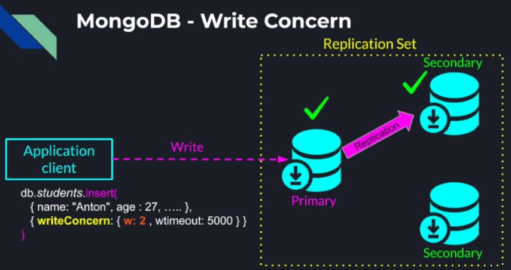 <br />
So when we issue the write operation from our application, we can specify a write concern of two or more nodes. <br />
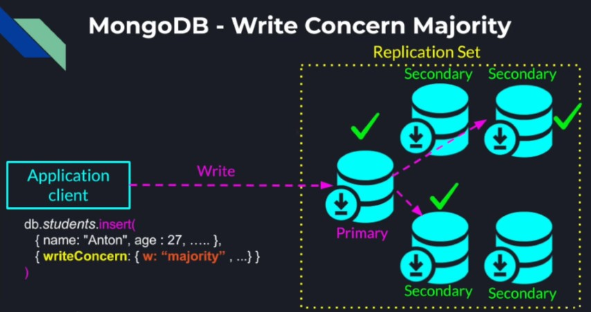 <br />
Similarly, we can specify majority to force the write to be replicated to the majority of the nodes regardless of the
cluster size. This is one of the reasons it is recommended to have an odd number of nodes at each replication set.

### Read Preferences

All the read operations are also directed to the primary to guarantee strict consistency however we can change that
behaviour using the read preference. <br />
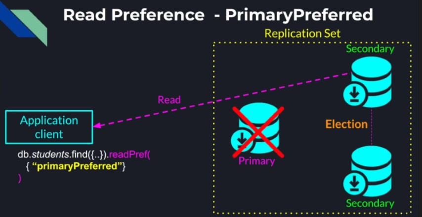 <br />
When we issue the read request, we can set the read preference to "primaryPreferred" to still read from the primary when
it's available but if the primary has failed and a new primary is not being elected yet, we can still read from the
secondary nodes that are not too much out of sync. <br />
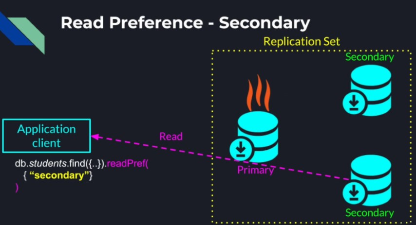 <br />
If the number of reads is too much for the primary, and we are fine with relaxing our consistency requirements to
eventual consistency, we can even set the preference to "secondary". <br />
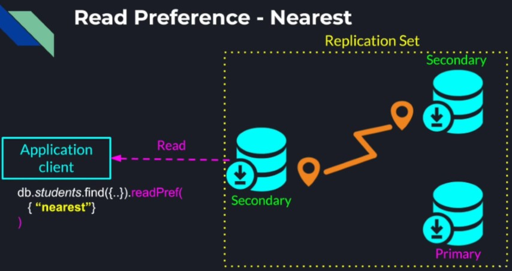 <br />
And if we deployed our replication set across multiple physical locations, we can specify the read preference to "
nearest" to read from the node that has the lowest latency to our application client. This again can result in reading
stale data however that is a tradeoff we're maybe willing to pay for a lower latency depending on the business
requirement.

```shell
mkdir -p /replica/rs0-0
mkdir -p /replica/rs0-1
mkdir -p /replica/rs0-2
mongod --replSet rs0 --port 27017 --bind_ip 127.0.0.1 --dbpath /replica/rs0-0 --oplogSize 128
mongod --replSet rs0 --port 27018 --bind_ip 127.0.0.1 --dbpath /replica/rs0-1 --oplogSize 128
mongod --replSet rs0 --port 27019 --bind_ip 127.0.0.1 --dbpath /replica/rs0-2 --oplogSize 128
mongo --port 27017
rs.initiate({ _id: "rs0", members: [{_id: 0, host: "127.0.0.1:27018"}, {_id: 1, host: "127.0.0.1:27019"}, {_id: 2, host: "127.0.0.1:27020"}] })
show dbs
use online-school
db.createCollection("physics")
show collections
```

**Summary**

* How to create replication sets, and provide high availability through redundancy.
* MongoDB's Master-Slave architecture, where a primary node takes all the writes and reads by default for consistency.
* Data is replicated asynchronously to the secondary nodes
* How to trade off write operation latency for higher reliability using Write Concern (2+ nodes, "majority")
* Using Read Preference we can trade-off strict consistency for eventual consistency, but get higher read throughput or
  lower latency

### Sharding Strategies in MongoDB

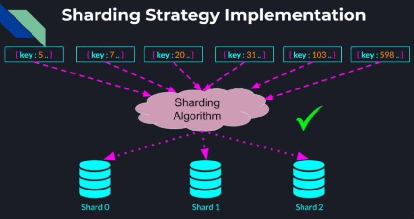 <br />

Supports two sharding strategies. The hash based strategy and range based sharding strategy. In either of these
strategies we first need to decide on the sharding key in a given collection. We can pick any field as the sharding key
but the decision on which key to shard on cannot be changed later and has important implications on whether our
collections can scale horizontally across shards or create hotspots in our system that we won't be able to recover
from. <br />
The key and the sharding strategy must be chosen together to guarantee:

* Scalability as the collection grows
* Efficient queries as the number of operations per second increases

In either of the strategies the records are bucketed into chunks, each chunk has a lower and upper bound and together
all the chunks are covering the entire keyspace. How documents are assigned to a particular chunk is based on the
sharding strategy. <br />

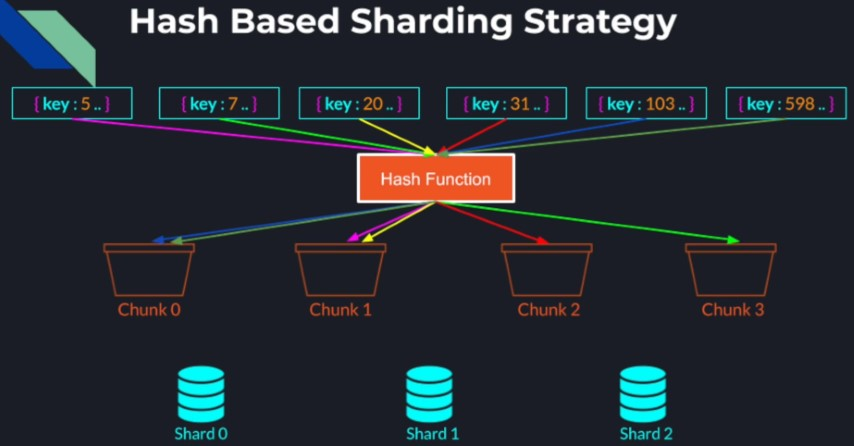 <br />

In the hash based sharding strategy, a hash function is applied on each of the document's keys and that determines the
chunk to which this document is assigned to. Notice again the consecutive key values maybe hashed to different
chunks. <br />

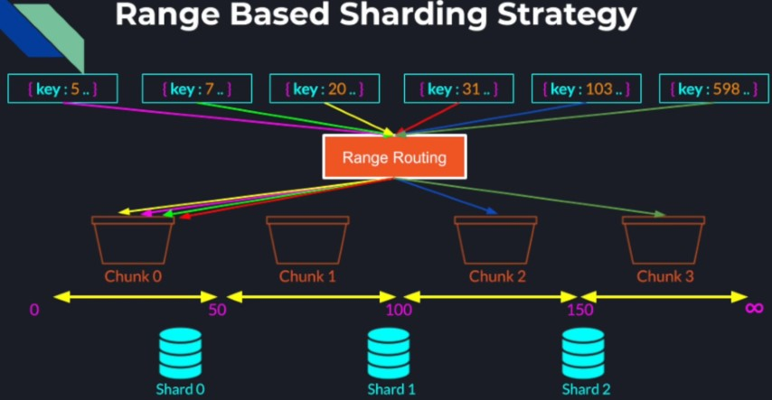 <br />

In the range based sharding we don't really need to apply any transformation on the key, instead we simply need to find
the chunk that corresponds to the range of keys that our documents key falls into. We expect documents with close by
keys are much more likely to be part of the same chunk. <br />

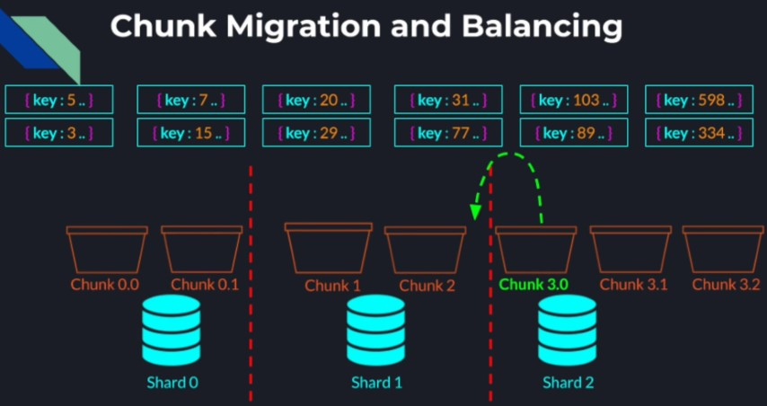 <br />

Once our documents are assigned to their chunks based on the sharding algorithm, the chunks are distributed evenly and
stored on the MongoDB shards. As we get more documents into our collection some of our chunks become bigger as they
contain more documents. When a configurable threshold of a chunk size or number of documents per chunk has exceeded, the
overcrowded chunk is split into multiple smaller chunks. Once MongoDB detects an uneven distribution of chunks among the
shards, their load is balanced through chunk migration from one shard to another shard. <br />

### MongoDB Router and Config servers

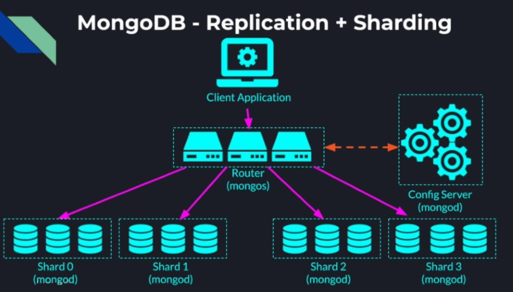 <br />

In order for the client application to actually know which shard to talk to in a given query, we need an additional
component called router which runs as a mongos instance. So instead of connecting to any shard directly the application
just needs to know the routers address and the router will direct the query to one or multiple shards depending on the
query. The router however only routes queries based on the current location of the chunks. The component that actually
makes the decision on where each chunk is going to be located and also performs the balancing among the shards is the
config server which also runs as a separate process (mongod). Essentially the router just routes queries based on the
information provided to it by the config server. Because the information in the config server is so critical for the
sharded cluster, MongoDB forces us to run the config server as a replication set. Of-course for complete fault tolerance
in production, we would want to run each shard as a replication set and have a pool of mongos instances (Router) instead
of one. This is to guarantee we don't have any single point of failure in our entire MongoDB cluster. Now we can add
servers to any replication set if needed and also add more shards depending on the traffic or the size of our dataset.

```shell
mkdir -p /config_server/config-srv-0
mkdir -p /config_server/config-srv-1
mkdir -p /config_server/config-srv-2
mongod --configsvr --replSet config-rs --port 27020 --bind_ip 127.0.0.1 --dbpath /config_server/config-srv-0
mongod --configsvr --replSet config-rs --port 27021 --bind_ip 127.0.0.1 --dbpath /config_server/config-srv-1
mongod --configsvr --replSet config-rs --port 27022 --bind_ip 127.0.0.1 --dbpath /config_server/config-srv-2
# group these config servers into a single replicated cluster
mongo --port 27020
rs.initiate({ _id: "config-rs", configsvr: true, members: [{_id: 0, host: "127.0.0.1:27020"}, {_id: 1, host: "127.0.0.1:27021"}, {_id: 2, host: "127.0.0.1:27022"}] })

mkdir -p /shards/shard-0
mkdir -p /shards/shard-1
mongod.exe --shardsvr --replSet shard-0 --port 27017 --bind_ip 127.0.0.1 --dbpath .\shard-0\ --oplogSize 128
mongod.exe --shardsvr --replSet shard-1 --port 27018 --bind_ip 127.0.0.1 --dbpath .\shard-1\ --oplogSize 128
mongo --port 27017
rs.initiate({ _id: "shard-0", members: [{_id: 0, host: "127.0.0.1:27017"}] })
mongo --port 27018
rs.initiate({ _id: "shard-1", members: [{_id: 0, host: "127.0.0.1:27018"}] })
# last component to glue everything together which is our mongos router
# --configdb config-rs/127.0.0.1:27020,127.0.0.1:27021,127.0.0.1:27022 <- config database location to the config server replication set which consists of our 3 config server nodes 
mongos --configdb config-rs/127.0.0.1:27020,127.0.0.1:27021,127.0.0.1:27022 --bind_ip 127.0.0.1 --port 27023
mongo --port 27023
sh.addShard("shard-0/127.0.0.1:27017")
sh.addShard("shard-1/127.0.0.1:27018")
show db
use config
db.settings.save({ _id: "chunksize", value: 1 }) 
# changed from 64MB to 1MB, this way we won't need to create too many documents to see the results
```

**Summary**

* Learned how to scale a distributed MongoDB using data sharding
* Learned about the two sharding strategies (Hashing and Range) MongoDB supports and how they are implemented in
  MongoDB.
* Documents are assigned to chunks that span the entire key space.
* Chunks are load balanced across the shards based on size and number of documents.
* mongos router that routes queries to the right shard
* Config server replication set that stores, maintains and balances the chunks among the shard nodes
* Ended with a fully replicated and distributed MongoDB architecture that can scale horizontally and recover from
  failures, transparently to the user.

### Example: Video on Demand Service

We have a large library of movies. A user can look up a movie by name or scroll through our library alphabetically and
see all the information about each movie before they decide to watch it. To provide such a service we are going to
create a database. And the database will have two collections, first collection will store all the information about out
movies and the second collection will store all the information about our users. <br />
Our task is to shard those collections in a scalable way that would allow our business to grow. <br />

**Movies Collection document**

<pre>
{
  "name": "Pulp Fiction",
  "directors": [
    "Quentin Tarantino"
  ],
  "year": 1994,
  "cast": [
    "Amanda Plummer",
    "Samuel L.Jackson",
    "Bruce Willis",
    "John Travolta",
    "Uma Thurman"
  ],
  "rating": 10
}
</pre>

```shell
use videodb
# this will allow us to shard collections within it
sh.enableSharding("videodb")
db.movies.insertOne({
  "name": "Pulp Fiction",
  "directors": [
    "Quentin Tarantino"
  ],
  "year": 1994,
  "cast": [
    "Amanda Plummer",
    "Samuel L.Jackson",
    "Bruce Willis",
    "John Travolta",
    "Uma Thurman"
  ],
  "rating": 10
})
db.movies.insertOne({
  "name": "Moana",
  "director": [
    "Ron C1ements",
    "John Husker",
    "Don Hall",
    "Chris Williams"
  ],
  "year": 2016,
  "cast": [
    "Auli'i wayne Jognson",
    "Rachel Housé",
    "Temuera MorriSon",
    "Jemaine Clément",
    "Nicole Scherzinger",
    "Alan Tudyk",
    "Oscar Knightley",
    "Troy Polamalu",
    "Puanani Cravalho"
  ],
  "rating": 9.9
})
db.movies.find().pretty()
# by default this collection is not yet sharded and resides fully on one single shard
```

**Movies Collection Observation**

* Each document can be quite big
* We don't expect to have a lot of updates or writes to the movies collection
* We expect to have a lot of reads of two types:
    * Query containing the movies name
    * Query containing an alphabetic range of movies names (when the user is scrolling through our movies library)

**Movies Collection Sharding**

* This leads us to two design decisions:
    * We want to shard the movies collection by "name". This is because if the sharding key is present in the query, our
      mongos router will know which shard to direct the query instead of broadcasting the query to all the shards.
    * Shard the movies collection using the range based strategy. This way if a query comes for the movies starting with
      the letter "P", they will much more likely to be on the same shard which will make our query very fast.

```shell
# start with creating an index for the name field in the movies collection which is a prerequisite to shard the collection on that key
db.movies.createIndex({ name: 1 })
# an index is a database structure that precomputes some data about the particular field in the collection ahead of time. 
# Typically it presorts or pre hashes the documents based on the given field to make queries involving this field more efficient.
# The index which we just created presorted our movies names and the '1' value means those names are pre sorted in an ascending order
sh.shardCollection("videodb.movies", { name: 1 })
# In this case '1' indicates that we are sharding using the range based strategy
# Now we know why the index was necessary, as once we already presorted our names alphabetically, sharding them simply involves breaking the names to chunks but the names order stays the same.
sh.status() 
```